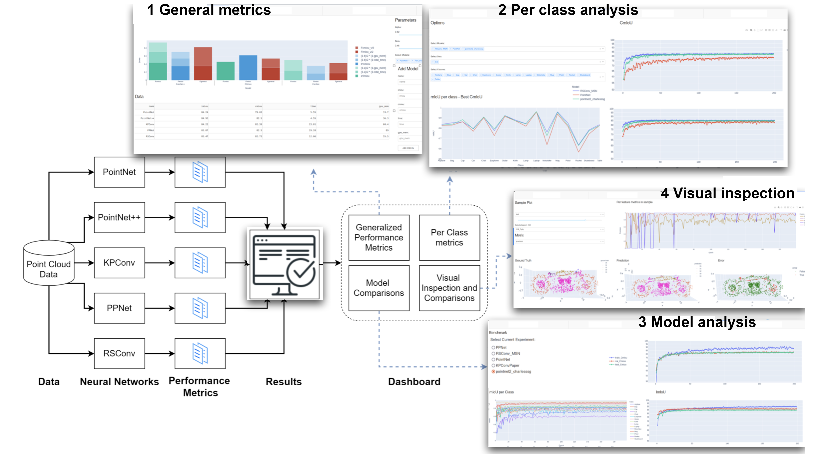
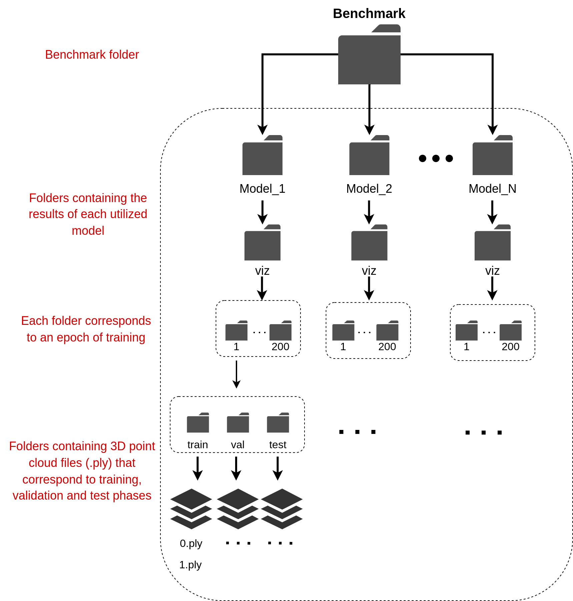

## CLOSED: A Dashboard for 3D Point Cloud Segmentation Analysis using Deep Learning

<p>
	
</p>

[CLOSED: A Dashboard for 3D Point Cloud Segmentation Analysis using Deep Learning](https://www.scitepress.org/Papers/2022/108260/108260.pdf)

Please consider citing this work if you find it influential or useful in your research.

```
@inproceedings{Zoumpekas2022VISAPP,
  author = {Zoumpekas, Thanasis and Molina, Guillem and Puig, Anna and Salamó, Maria},
  title = {CLOSED: A Dashboard for 3D Point Cloud Segmentation Analysis using Deep Learning},
  booktitle = {Proceedings of the 17th International Joint Conference on Computer Vision, Imaging and Computer Graphics Theory and Applications - Volume 4: VISAPP,},
  year = {2022},
  pages = {403-410},
  publisher = {SciTePress},
  organization = {INSTICC},
  doi = {10.5220/0010826000003124},
  isbn = {978-989-758-555-5},
  issn = {2184-4321},
}
```

## Installation

Please install [Python Poetry][https://python-poetry.org/].
Then simply run (inside the project directory):

```
poetry install
```

## Usage

If you want to use the dashboard as it is please use the below folder taxonomy of your 3D point clouds files. Then simply run ```poetry run python dashboard.py``` inside the project directory.
<p>
	
</p>

If you use the [Torch-Points 3D][https://github.com/torch-points3d/torch-points3d] framework for running deep learning models for 3D point cloud analysis, then you can change the path of ```DIR``` and ```benchmark_dir``` inside the ```dashboard.py``` to match the benchmark directory of your runs and run ```poetry run python dashboard.py``` inside the project directory.


## License

MIT LICENSE.